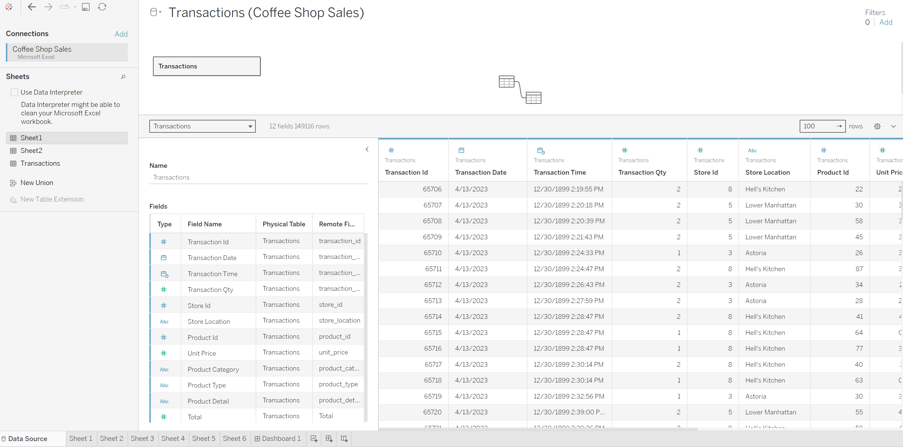
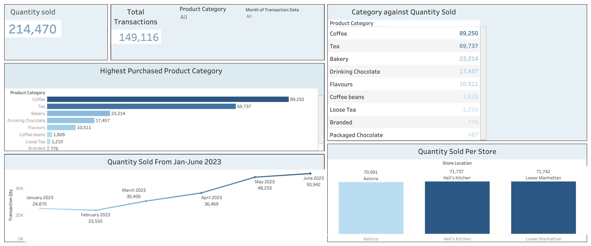

# Coffee Shop Sales Analysis

--- 
## INTRODUCTION 

This is a Tableau project on sales analysis of an imaginary Coffee store called **Coffee Shop**.
The project is to analyze and derive insights to answer crucial business questions and help the store make data-driven decisions.
**_Disclaimer_**: _All datasets and reports do not represent any company, store, institution, or country, but just a dummy dataset to demonstrate the capabilities of TABLEAU._

---
## Problem Statement: 

Problem Statement
1. Which Store has the highest sales,
2. Which product/product categories get more demand than stores supply's,
3. What is the Highest valued product categories,
4. Which months has the highest sales/demand?

## Skills/Concepts demonstrated:

The following PowerBI tools were utilized:

- Data importation, 
- Sorting/arrangement,
- Dashboard Design,
- Slicers

## Data Cleaning/Data modeling:

---

## Visualization:
This Dashboard shows the main points but is not limited to the problem stated above, also denoting the sales from Jan-June.

---

## Features
- The slicers on product-categories and date show the interactiveness of the dashboard making changes on every chart,
- This indicates and displays pieces of information on the particular charts referred to.
---
## Analysis:

### Product Catalog:
There are 9 product categories and 29 types of products in all the stores but the highest sold 8 are represented on the dashboard.
Also to note that Coffee and Chocolates have the highest sales.

### Transaction History:
There were 149,116k orders in total from Jan-June 2023.

### Store: 
There are 3 stores currently operating and Hell's Kitchen Store has the highest sales. 

## Conclusion and Recommendations:
Coffee and Chocolate are the most in demand at each store.
Hell's Kitchen has the highest sales and generates more revenue but just a slight difference from other stores.

#Recommendation: 
The coffee and chocolate categories should be restocked as soon as possible based on weekly sales so the store won't run out of the products,
All  should be paid more attention to for redistribution
